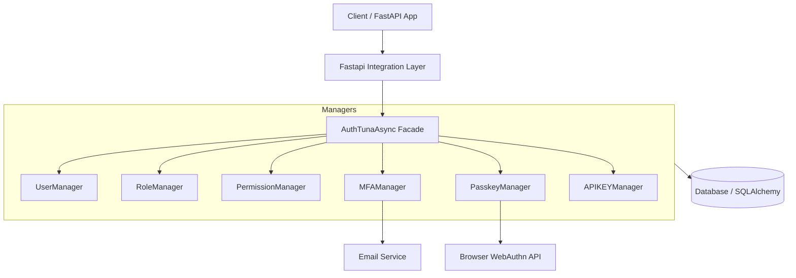
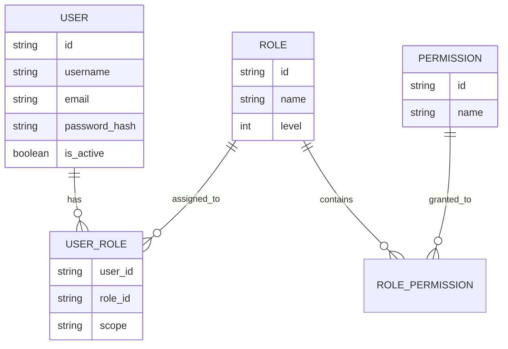
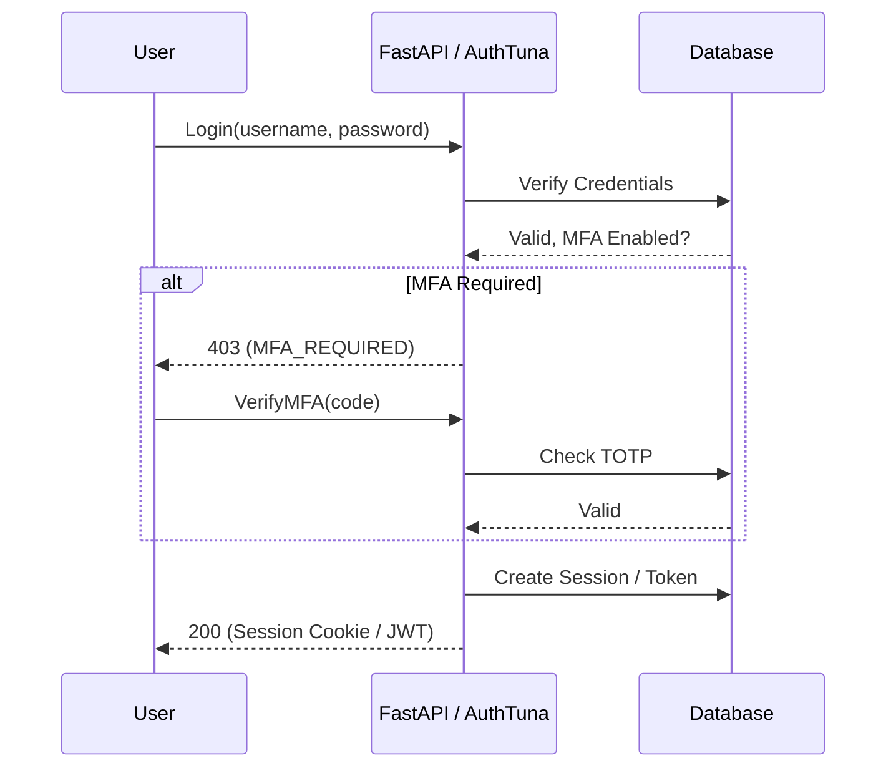
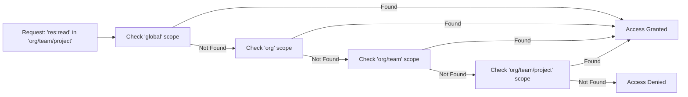

# AuthTuna Architecture

This document visualizes the core architecture and data flows of AuthTuna.

## Core Component Diagram

The `AuthTunaAsync` facade orchestrates various managers that interact with the database and external services.

## Technology Stack

- **Framework**: FastAPI (Python 3.8+)
- **ORM**: SQLAlchemy 2.0 (Async)
- **Supported Databases**: 
    - **PostgreSQL** (via `asyncpg`)
    - **SQLite** (via `aiosqlite`)
    - *Note: Other databases are currently not supported.*
- **Encryption**: Fernet-wrapped AES-256 (Envelope Encryption) & Argon2/Bcrypt.
- **SSO**: Authlib (OAuth2/OIDC).

## Security Core

### Session Replay Protection (Random String Rotation)
Unlike static session IDs, AuthTuna rotates a `random_string` on every request.
1. The middleware extracts the `random_string` from the session cookie/token.
2. It validates it against the current string or a short history of `previous_random_strings` (to handle race conditions).
3. A new string is generated and persisted for the next request.
4. An old string reuse triggers immediate session termination and an audit event.

### Envelope Encryption & Crypto-Shredding
- **Storage**: Email and PII are stored in `email_encrypted` (binary) using a per-user AES-256 key.
- **Wrapping**: The AES-256 key is encrypted (Fernet) using a system master key and stored in the `EncryptionKey` table.
- **Shredding**: `erase_user()` deletes the `EncryptionKey` record. Without the wrapped key, the binary data in `users` becomes undecipherable "digital dust".

## RBAC Data Model

AuthTuna uses a hierarchical RBAC model with support for scoped assignments.

## Authentication Flow (With MFA)

## Scoped Permission Resolution

How AuthTuna resolves permissions across hierarchical scopes.

### Scope Resolution & Escalation Prevention
AuthTuna resolves scopes hierarchically using the `/` delimiter (e.g., `org/team/project`).
- **Encompassing Logic**: A manager with an `admin` role in `org` automatically encompasses `org/team`.
- **Escalation Check**: The `_is_authorized_to_manage_role` method ensures that an assigner cannot grant a role in a scope they do not themselves encompass. This prevents a Team Lead from granting Org-level roles.

### API Key Constraints
API Keys are restricted by a **Composite Foreign Key** on `(user_id, role_id, scope)`.
- **Inheritance Only**: An API key can only be granted roles/scopes that the owning user *already possesses*. 
- **Security**: This ensures API keys cannot be used to escalate privileges beyond the user's own account limits.
