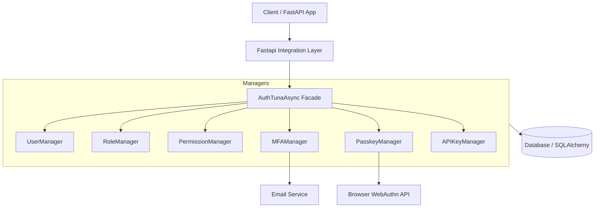
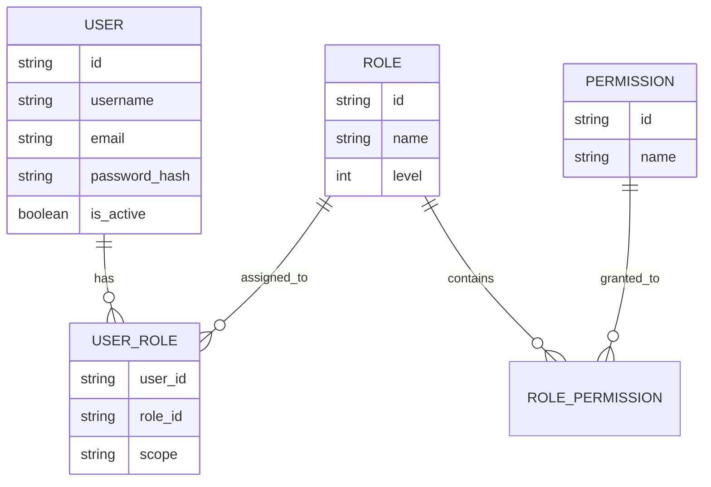
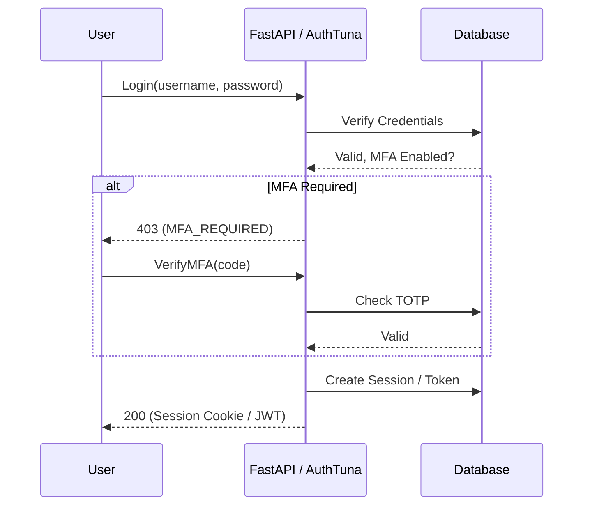
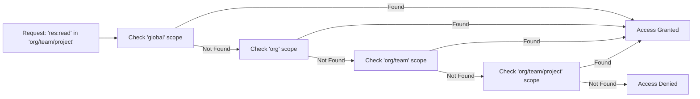

# AuthTuna Architecture

This document visualizes the core architecture and data flows of AuthTuna.

## Core Component Diagram

The `AuthTunaAsync` facade orchestrates various managers that interact with the database and external services.

## Technology Stack

- **Framework**: FastAPI (Python 3.8+)
- **ORM**: SQLAlchemy 2.0 (Async)
- **Supported Databases**: 
    - **PostgreSQL** (via `asyncpg`)
    - **SQLite** (via `aiosqlite`)
    - *Note: Other databases are currently not supported.*
- **Encryption**: Fernet (Cryptography) & Argon2/Bcrypt.
- **SSO**: Authlib (OAuth2/OIDC).

## RBAC Data Model

AuthTuna uses a hierarchical RBAC model with support for scoped assignments.

## Authentication Flow (With MFA)

## Scoped Permission Resolution

How AuthTuna resolves permissions across hierarchical scopes.

