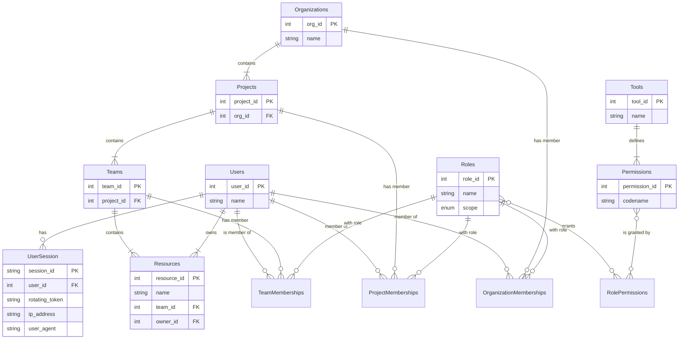

# AuthTuna 🐟

A high-performance, framework-agnostic authorization and session management library for Python.

AuthTuna provides a robust, multi-layered security foundation for modern web applications. It is designed for developers who need to build complex, multi-tenant systems without compromising on security or performance. The library combines a powerful hierarchical permission model with an advanced, stateful session management system to actively defend against a wide range of modern threats.

This project is built on the philosophy that robust security should be accessible, not an afterthought. It provides the tools to manage complex authorization logic in a way that is both intuitive and highly secure.

## Core Concepts

AuthTuna is built on a few key architectural principles:

- **Hierarchical RBAC (Role-Based Access Control)**: Permissions are not global. They are structured in a logical, multi-level hierarchy perfect for SaaS and collaborative platforms: Organization ➡️ Project ➡️ Team ➡️ Resource. A user's abilities can change depending on their context.

- **Object-Level Security**: Go beyond simple roles with fine-grained permissions based on a resource's specific attributes, such as ownership. This allows for intuitive rules like "a user can always edit their own posts."

- **Advanced Session Management**: A high-security, dual-state session model that actively detects and prevents session hijacking. It uses a server-side session store as the source of truth, providing full control over session validity.

- **Framework-Agnostic Design**: A clean core engine written in pure Python, with dedicated adapters for seamless integration with modern web frameworks like FastAPI.

## Features

- **Multi-Level Hierarchical Permissions**: Manage complex user roles across different organizational contexts with a clear and scalable data model.

- **Object-Level Ownership Rules**: Easily define and check for permissions based on a user's relationship to a specific resource.

- **Dual-State Session Management**: Combines a secure, server-side session store with a rotating JWT cookie for maximum security and control.

- **Rotating Tokens**: The core of our session security. Each token is single-use, mitigating replay attacks and providing immediate, real-time breach detection.

- **Session Hijack Detection**: Actively monitors sessions by "fingerprinting" the user's IP address and User-Agent on every request and comparing it against the secure server-side record.

- **Built-in CSRF Protection**: The SameSite=Lax cookie strategy is the default, protecting all state-changing endpoints from cross-site request forgery.

- **SQL-First Design**: Optimized for performance and data integrity with relational databases like PostgreSQL. The data access patterns are designed to leverage the power of SQL for complex, relational queries.

## Installation

The library is designed to be modular. You can install the core engine by itself or with framework-specific extras.

```bash
# Install the core library
pip install authtuna

# Install with FastAPI integration and its dependencies
pip install authtuna[fastapi]
```

## Quick Start

Here's a brief example of how to protect a FastAPI route using AuthTuna's core components.

```python
from fastapi import FastAPI, Depends, HTTPException
from authtuna.core.authorizer import Authorizer
from authtuna.integrations.fastapi import get_authorizer, get_current_user
from authtuna.data.models import User, Post  # Your application's models

# Assume 'authorizer' is initialized with your data provider in your app's setup
app = FastAPI()

# A protected route to edit a blog post
@app.put("/posts/{post_id}")
async def edit_post(
    post_id: int,
    user: User = Depends(get_current_user),
    authorizer: Authorizer = Depends(get_authorizer)
):
    """
    This endpoint allows a user to edit a post, but only if they have
    the required permissions as determined by AuthTuna.
    """
    # 1. Fetch the resource from the database
    # This is the object we want to check permissions against.
    post_to_edit = await get_post_by_id(post_id)
    if not post_to_edit:
        raise HTTPException(status_code=404, detail="Post not found")

    # 2. Check permission using the Authorizer
    # This single call executes the entire multi-stage check:
    # - Is the user the owner of the post?
    # - Does their role in the post's team, project, or org grant permission?
    if not authorizer.can(user, "post:edit", post_to_edit):
        # If the check fails, deny access.
        raise HTTPException(
            status_code=403, 
            detail="You do not have permission to perform this action."
        )

    # 3. If the check passes, proceed with the business logic
    # ... update the post in the database
    
    return {"status": "success", "message": "Post updated successfully."}
```

## Architectural Diagram

This diagram shows the complete data structure for the authorization and session management system, designed for optimal performance and clarity.



## Security Overview 🛡️

AuthTuna is designed with a defense-in-depth strategy. Security is not a single feature but a result of the entire architecture working together.

| Attack Vector | Defense Strategy & Implementation |
|---------------|-----------------------------------|
| **Session Hijacking** | IP/User-Agent fingerprinting is performed on every request, comparing against the secure server-side record. The rotating token provides immediate, real-time breach detection if a stolen cookie is used. |
| **Replay Attacks** | The core session model is built on one-time-use rotating tokens. An intercepted request is useless because the token becomes invalid after its first use. |
| **CSRF** | The primary defense is the SameSite=Lax cookie attribute, which prevents browsers from sending the session cookie on unauthorized cross-site POST, PUT, etc., requests. |
| **XSS** | The core session_id is stored in an HttpOnly cookie, preventing direct access from JavaScript. This is combined with a strong Content Security Policy (CSP) and proper output encoding in the application. |
| **Timing Attacks** | All comparisons of secret values (like the rotating_token) are performed using a constant-time comparison function (e.g., Python's hmac.compare_digest). |
| **Credential Stuffing** | While outside the library's direct scope, we strongly recommend rate limiting, CAPTCHA, and Multi-Factor Authentication (MFA) on the application's login form. |
| **Insecure Direct Object Ref.** | The core authorizer.can(user, permission, resource) check is the fundamental defense against IDOR, ensuring a user is authorized for the specific resource they are requesting. |
| **Session Fixation** | A new, cryptographically secure session_id is generated in the database after every successful login, ensuring a user cannot be forced into a pre-existing session. |

## Contributing

We welcome contributions of all kinds! Whether it's reporting a bug, proposing a new feature, or submitting a pull request, your help is valued. Please feel free to open an issue to start a discussion.

## License

This project is licensed under the MIT License. See the LICENSE file for details.